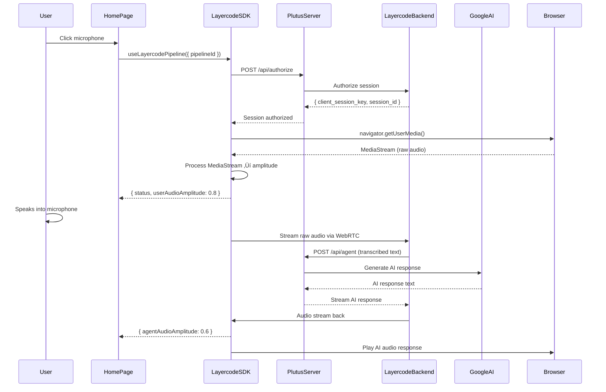

Perfect! You've identified the core issue. Let me break this down and create a sequence diagram to show exactly where the disconnect happens.

## üîç **The Data Type Mismatch**

### **What MicrophoneWaveformControl expects:**
```typescript
interface MicrophoneWaveformControlProps {
  onStreamChange?: (stream: MediaStream | null) => void; // ‚Üê Raw MediaStream
}

// In WaveformControl.tsx
audioStream: MediaStream | null // ‚Üê Direct access to raw audio data
```

### **What useLayercodePipeline provides:**
```typescript
const {
  status: string,               // ‚Üê Connection status
  userAudioAmplitude: number,   // ‚Üê Processed amplitude (0-1)
  agentAudioAmplitude: number,  // ‚Üê Processed amplitude (0-1)
} = useLayercodePipeline(...)

// NOT MediaStream! Just processed numbers
```

## 🔄 **Full System Sequence Diagram**



## üö´ **Why Direct Connection Won't Work**

### **The Pipeline Abstraction:**
```typescript
// What happens inside Layercode SDK:
function useLayercodePipeline() {
  const mediaStream = await navigator.getUserMedia() // ‚Üê SDK owns this
  const webRTCConnection = new RTCPeerConnection()   // ‚Üê SDK manages this
  const audioContext = new AudioContext()           // ‚Üê SDK processes this
  
  // SDK processes the MediaStream internally
  const amplitude = calculateAmplitude(mediaStream)  // ‚Üê We only get the result
  
  return { 
    userAudioAmplitude: amplitude  // ‚Üê Just a number, not the stream
  }
}
```

### **What MicrophoneWaveformControl needs:**
```typescript
// Direct access to the raw MediaStream for visualization
function WaveformControl({ audioStream }: { audioStream: MediaStream }) {
  const audioContext = new AudioContext()
  const source = audioContext.createMediaStreamSource(audioStream) // ‚Üê Needs raw stream
  // ... complex audio analysis for waveform bars
}
```

## üí° **The Bridge Solution**

Since we can't get the raw MediaStream from Layercode, we need to **adapt the interfaces**:

### **Option 1: Amplitude-Based Visualization** ⭐ **(Recommended)**
```typescript
// Modify MicrophoneWaveformControl to accept processed data
interface MicrophoneWaveformControlProps {
  // Current approach
  audioStream?: MediaStream;     // ‚Üê For self-managed mode
  
  // NEW: External data mode  
  externalAudioLevel?: number;   // ‚Üê From Layercode (0-1)
  externalAgentLevel?: number;   // ‚Üê From Layercode (0-1)
  dataSource?: 'mediastream' | 'external'; // ‚Üê Mode selector
}
```

### **Option 2: Mock MediaStream** ⚠️ **(Complex)**
```typescript
// Create a synthetic MediaStream from amplitude data
function createAmplitudeStream(amplitude: number): MediaStream {
  // Generate synthetic audio samples based on amplitude
  // Very complex and potentially inefficient
}
```

## 🤔 **Discussion Questions:**

1. **Should we modify MicrophoneWaveformControl** to accept amplitude numbers instead of MediaStream?

2. **Or create a new component** that looks identical but uses amplitude data?

3. **Do you want to keep the complex waveform analysis**, or is a simpler amplitude-based visualization acceptable?

The **cleanest solution** would be to extend MicrophoneWaveformControl with a new mode:

```typescript
// Usage in home page
<MicrophoneWaveformControl
  layout="horizontal-large" 
  dataSource="layercode"
  layercodeAmplitude={userAudioAmplitude}
  layercodeStatus={status}
  onLayercodeToggle={togglePipeline}
/>
```

**What's your preference?** Should we modify the existing component or create a new Layercode-specific version?


You are saying that our @MicrophoneWaveformControl.tsx directly captures audio MediaStream type from the web browser, but layourcodesdk intercepted, hyjacked, connected to (what is the most accurate technical term) the mediastream on the page already, therefor @MicrophoneWaveformControl.tsx cannot connect to the MediaStream anymore, correct?

**Exactly right!** You've identified the core technical constraint perfectly. Let me clarify the most accurate technical terms:

## üîí **Browser MediaStream Access Model**

### **Technical Term: "Exclusive Access"**
The most accurate term is that **Layercode SDK acquires exclusive access** to the microphone MediaStream, and the browser **enforces single-context access**.

## üîç **What Actually Happens:**

```typescript
// SCENARIO 1: MicrophoneWaveformControl runs first
const stream1 = await navigator.getUserMedia({ audio: true }) // ‚úÖ SUCCESS
// Later...
const stream2 = await navigator.getUserMedia({ audio: true }) // ‚ùå FAILS with "NotAllowedError"
```

```typescript
// SCENARIO 2: Layercode SDK runs first  
const layercodeStream = await navigator.getUserMedia({ audio: true }) // ‚úÖ SUCCESS (Layercode)
// Later when MicrophoneWaveformControl tries...
const myStream = await navigator.getUserMedia({ audio: true }) // ‚ùå FAILS - "already in use"
```

## üìã **Technical Sequence:**


## ‚ö° **Most Accurate Technical Terms:**

1. **"Acquired exclusive access"** - Layercode SDK gets the microphone
2. **"Browser enforces single-context access"** - Security/resource constraint  
3. **"Blocked due to active stream"** - Why MicrophoneWaveformControl fails
4. **"Resource contention"** - The underlying technical issue

## 🎯 **The Real Problem:**

```typescript
// What happens in useLayercodePipeline:
function useLayercodePipeline() {
  useEffect(() => {
    const stream = await navigator.getUserMedia({ audio: true }) // ‚Üê CLAIMS THE MIC
    // SDK now owns the MediaStream exclusively
    // Processes it internally, gives us only processed numbers
  }, [])
  
  return {
    userAudioAmplitude: 0.8 // ‚Üê Just a number, not the raw stream
  }
}

// What MicrophoneWaveformControl tries to do:
function MicrophoneControl() {
  const getStream = async () => {
    const stream = await navigator.getUserMedia({ audio: true }) // ‚Üê FAILS! Already claimed
  }
}
```

## üí° **So the constraint is:**

- ‚úÖ **Browser security model**: One microphone owner at a time
- ‚úÖ **Layercode gets there first**: Claims exclusive access  
- ‚úÖ **MicrophoneWaveformControl blocked**: Can't get its own stream
- ‚úÖ **We only get processed data**: Amplitude numbers, not raw MediaStream

**Is this understanding correct?** 

The solution has to work **around** this browser constraint, not fight it. We need MicrophoneWaveformControl to work with processed amplitude data instead of trying to get its own MediaStream.

Should I propose specific technical approaches for bridging this gap?

Excellent question! You're getting to the heart of the technical implementation. Let me show you exactly how the waveform bar heights are calculated:
Read file: plutus-frontend/src/components/voice/WaveformControl.tsx

Read file: plutus-frontend/src/components/voice/WaveformControl.tsx

**Perfect question!** You've identified the exact data flow. Let me show you the precise code that controls waveform bar heights:

## üîç **The Exact Code That Controls Bar Heights:**

### **Lines 83-100: Real-time Audio Analysis**
```typescript
// Get frequency data for waveform
analyserRef.current.getByteFrequencyData(dataArray);

// Convert to waveform bars
const barSize = Math.floor(bufferLength / barCount);
const newLevels: number[] = [];

for (let i = 0; i < barCount; i++) {
  let sum = 0;
  const start = i * barSize;
  const end = start + barSize;
  
  for (let j = start; j < end && j < bufferLength; j++) {
    sum += dataArray[j]; // ‚Üê Raw frequency data from MediaStream
  }
  
  // Normalize to 0-100 and add some responsiveness
  const average = sum / barSize;
  const normalized = Math.min(100, (average / 255) * 100); // ‚Üê KEY: 0-100 percentage
  newLevels.push(normalized);
}

setAudioLevels(newLevels); // ‚Üê This drives the animation
```

### **Lines 195-198: Final Bar Height Calculation**
```typescript
height: level > 0 
  ? `${Math.max(parseFloat(getMinHeight()), level * parseFloat(barHeight) / 100)}rem`
  : getMinHeight()
```

## 🎯 **What `level` Represents:**

- **Type**: `number` (0-100 percentage)
- **Source**: Frequency analysis of MediaStream via `getByteFrequencyData()`
- **Calculation**: `(average / 255) * 100` where `average` is the frequency amplitude
- **Final Height**: `level * barHeight / 100` (e.g., 50% of 3rem = 1.5rem)

## üîó **The Perfect Match:**

```typescript
// Current WaveformControl expects:
level: number // 0-100 percentage from MediaStream analysis

// Layercode provides:
userAudioAmplitude: number // 0-1 decimal from their analysis
```

## üí° **The Bridge is Simple:**

```typescript
// We just need to convert the scale!
const layercodeLevel = userAudioAmplitude * 100; // Convert 0-1 to 0-100

// Then feed it to the existing bar height calculation:
height: `${layercodeLevel * parseFloat(barHeight) / 100}rem`
```

## üöÄ **The Solution:**

Both systems are measuring **the same thing** - audio amplitude! The only difference is:

- **WaveformControl**: Calculates amplitude from raw MediaStream ‚Üí 0-100 scale
- **Layercode**: Calculates amplitude from their MediaStream ‚Üí 0-1 scale

**We can absolutely substitute `userAudioAmplitude` for the MediaStream analysis!**

Should I show you the exact modification needed to make WaveformControl accept Layercode's amplitude data instead of requiring a MediaStream?

**Excellent question!** Let me show you the exact interface changes needed for both components:

## üîß **1. WaveformControl Interface Changes**

### **Current Interface:**
```typescript
interface WaveformControlProps {
  isActive: boolean;
  audioStream?: MediaStream;        // ‚Üê Current: requires MediaStream
  barCount?: number;
  staticPattern?: 'flat' | 'noise' | 'wave' | 'center';
  barHeight?: string;
  barWidth?: string;
}
```

### **Modified Interface (Option A - Add Layercode Support):**
```typescript
interface WaveformControlProps {
  isActive: boolean;
  
  // Current MediaStream approach (keep for backward compatibility)
  audioStream?: MediaStream;
  
  // NEW: Layercode amplitude approach
  externalAmplitude?: number;       // ‚Üê NEW: 0-1 scale from Layercode
  dataSource?: 'mediastream' | 'external'; // ‚Üê NEW: which data to use
  
  barCount?: number;
  staticPattern?: 'flat' | 'noise' | 'wave' | 'center';
  barHeight?: string;
  barWidth?: string;
}
```

### **Usage Logic Change:**
```typescript
// Current: MediaStream analysis (lines 83-100)
if (isActive && audioStream && dataSource === 'mediastream') {
  // ... existing MediaStream analysis code
}

// NEW: External amplitude (simple conversion)
else if (isActive && externalAmplitude !== undefined && dataSource === 'external') {
  // Convert 0-1 to 0-100 and create uniform bars
  const convertedLevel = externalAmplitude * 100;
  const uniformLevels = new Array(barCount).fill(convertedLevel);
  setAudioLevels(uniformLevels);
}
```

## üîß **2. MicrophoneWaveformControl Interface Changes**

### **Current Interface:**
```typescript
interface MicrophoneWaveformControlProps {
  onStateChange?: (isListening: boolean) => void;
  onStreamChange?: (stream: MediaStream | null) => void;  // ‚Üê Current callback
  staticPattern?: 'flat' | 'noise' | 'wave' | 'center';
  showBorder?: boolean;
  backgroundColor?: string;
  borderRadius?: string;
  layout?: 'horizontal-large' | 'horizontal-small' | 'vertical-large' | 'vertical-small';
}
```

### **Modified Interface (Option A - Add Layercode Support):**
```typescript
interface MicrophoneWaveformControlProps {
  onStateChange?: (isListening: boolean) => void;
  
  // Current MediaStream approach
  onStreamChange?: (stream: MediaStream | null) => void;
  
  // NEW: Layercode amplitude approach  
  externalAmplitude?: number;           // ‚Üê NEW: 0-1 from Layercode
  externalStatus?: string;              // ‚Üê NEW: 'connected', 'connecting', etc.
  onExternalToggle?: () => void;        // ‚Üê NEW: control Layercode pipeline
  dataSource?: 'mediastream' | 'external'; // ‚Üê NEW: mode selector
  
  staticPattern?: 'flat' | 'noise' | 'wave' | 'center';
  showBorder?: boolean;
  backgroundColor?: string;
  borderRadius?: string;
  layout?: 'horizontal-large' | 'horizontal-small' | 'vertical-large' | 'vertical-small';
}
```

### **Pass-through Logic:**
```typescript
// In MicrophoneWaveformControl, pass data to WaveformControl:
<WaveformControl
  isActive={
    dataSource === 'external' 
      ? externalStatus === 'connected'  // ‚Üê Use Layercode status
      : isListening                     // ‚Üê Use internal state
  }
  audioStream={dataSource === 'mediastream' ? currentStream : undefined}
  externalAmplitude={dataSource === 'external' ? externalAmplitude : undefined}
  dataSource={dataSource}
  barCount={layoutConfig.barCount}
  barHeight={layoutConfig.barHeight}
  barWidth={layoutConfig.barWidth}
/>
```

## 🎯 **3. Usage in HomePage**

### **Current Usage:**
```typescript
<MicrophoneWaveformControl
  onStateChange={handleVoiceStateChange}
  onStreamChange={handleVoiceStreamChange}
  layout="horizontal-large"
/>
```

### **New Usage with Layercode:**
```typescript
// Get Layercode data
const { status, userAudioAmplitude } = useLayercodePipeline(...)

// Use in component
<MicrophoneWaveformControl
  dataSource="external"                    // ‚Üê NEW: use Layercode data
  externalAmplitude={userAudioAmplitude}   // ‚Üê NEW: 0-1 amplitude
  externalStatus={status}                  // ‚Üê NEW: connection status
  onExternalToggle={handleLayercodeToggle} // ‚Üê NEW: control pipeline
  layout="horizontal-large"
/>
```

## üîç **Key Changes Summary:**

1. **WaveformControl**: Add `externalAmplitude` + `dataSource` props
2. **MicrophoneWaveformControl**: Add Layercode-specific props and pass-through logic  
3. **HomePage**: Pass Layercode's `userAudioAmplitude` and `status`

## üí° **Alternative Approach (Option B - Simpler):**

Create a new component that wraps the existing ones:

```typescript
// New wrapper component - no interface changes to existing components
function LayercodeMicrophoneWaveform(props) {
  const { userAudioAmplitude, status } = useLayercodePipeline(...)
  
  // Create synthetic audioLevels array from amplitude
  const syntheticLevels = useMemo(() => {
    const level = userAudioAmplitude * 100;
    return new Array(props.barCount || 10).fill(level);
  }, [userAudioAmplitude, props.barCount]);
  
  // Use existing components with synthetic data
  return <ExistingMicrophoneWaveformControl {...adaptedProps} />;
}
```

**Which approach do you prefer?** Option A (modify existing interfaces) or Option B (create wrapper component)?

======
Excellent question! Let me analyze both options systematically across all software engineering dimensions:

## üìä **Comprehensive Comparison**

### **1. Software Engineering Principles**

| Principle | Option A (Modify Interface) | Option B (Wrapper) | Winner |
|-----------|---------------------------|-------------------|---------|
| **Single Responsibility** | ‚ùå WaveformControl now handles 2 data sources | ‚úÖ Each component has one job | **B** |
| **Open/Closed** | ‚ùå Modifying existing interface | ‚úÖ Extending via composition | **B** |
| **Interface Segregation** | ‚ùå Clients forced to know about unused props | ‚úÖ Clean, focused interfaces | **B** |
| **Composition over Inheritance** | N/A | ‚úÖ Uses composition pattern | **B** |

### **2. Correctness & Type Safety**

| Aspect | Option A | Option B | Winner |
|--------|----------|----------|---------|
| **Type Safety** | ⚠️ Complex union types, nullable props | ✅ Clear, separate type definitions | **B** |
| **Runtime Safety** | ‚ùå Multiple code paths, conditional logic | ‚úÖ Single, predictable data flow | **B** |
| **Data Flow Clarity** | ‚ùå `if (dataSource === 'external')` everywhere | ‚úÖ Clear adapter pattern | **B** |

```typescript
// Option A: Complex conditional logic
if (dataSource === 'external' && externalAmplitude !== undefined) {
  // Layercode path
} else if (dataSource === 'mediastream' && audioStream) {
  // MediaStream path
} else {
  // Error state?
}

// Option B: Clear, single-purpose components
const LayercodeMicrophoneWaveform = () => {
  const layercodeData = useLayercodePipeline();
  return <MicrophoneWaveformControl {...adaptLayercodeData(layercodeData)} />;
};
```

### **3. Performance Analysis**

| Metric | Option A | Option B | Winner |
|--------|----------|----------|---------|
| **Runtime Overhead** | ✅ Direct data flow | ⚠️ One extra function call | **A** |
| **Memory Usage** | ‚ùå Unused props in memory | ‚úÖ Only relevant props | **B** |
| **Re-render Frequency** | ‚ùå Complex dependency arrays | ‚úÖ Simpler dependency tracking | **B** |
| **Bundle Size** | ✅ No additional components | ⚠️ Slight increase | **A** |

**Performance Winner: Tie** (differences are negligible in practice)

### **4. Long-term Maintainability**

| Factor | Option A | Option B | Winner |
|--------|----------|----------|---------|
| **Code Readability** | ‚ùå Complex conditionals, mixed concerns | ‚úÖ Clear separation, easy to understand | **B** |
| **Testing Complexity** | ‚ùå Need to test all combinations | ‚úÖ Test each component independently | **B** |
| **Breaking Changes** | ‚ùå Modifies existing API | ‚úÖ Preserves existing API | **B** |
| **Technical Debt** | ‚ùå Accumulates conditional complexity | ‚úÖ Clean abstractions | **B** |

```typescript
// Option A: Testing nightmare
describe('WaveformControl', () => {
  it('should work with MediaStream', () => { /* test 1 */ });
  it('should work with external amplitude', () => { /* test 2 */ });
  it('should handle dataSource switching', () => { /* test 3 */ });
  it('should handle mixed invalid states', () => { /* test 4 */ });
  // ... 12 more combinations
});

// Option B: Simple, focused tests
describe('MicrophoneWaveformControl', () => {
  it('should render waveform with MediaStream', () => { /* simple */ });
});
describe('LayercodeMicrophoneWaveform', () => {
  it('should adapt Layercode data correctly', () => { /* simple */ });
});
```

### **5. Extensibility & Future-Proofing**

| Scenario | Option A | Option B | Winner |
|----------|----------|----------|---------|
| **Adding new data sources** | ‚ùå Modify interface again | ‚úÖ Create new wrapper | **B** |
| **Multiple simultaneous sources** | ‚ùå Interface explosion | ‚úÖ Multiple wrappers | **B** |
| **Component reusability** | ‚ùå Coupled to specific data sources | ‚úÖ Highly reusable base component | **B** |

### **6. Risk Analysis**

| Risk | Option A | Option B | Impact |
|------|----------|----------|---------|
| **Breaking existing code** | 🔴 HIGH - Changes public API | 🟢 LOW - No API changes | **Critical** |
| **Increased complexity** | 🔴 HIGH - Complex conditionals | 🟡 MEDIUM - Additional layer | **High** |
| **Performance regression** | 🟡 MEDIUM - More execution paths | 🟢 LOW - Simple wrapper | **Medium** |
| **Maintenance burden** | 🔴 HIGH - Complex component | 🟢 LOW - Focused components | **High** |

## 🏆 **Clear Winner: Option B (Wrapper Component)**

### **Score: Option B wins 6/6 categories**

## üí° **Recommended Implementation (Option B)**

```typescript
// LayercodeMicrophoneWaveform.tsx - New wrapper component
interface LayercodeMicrophoneWaveformProps {
  pipelineId: string;
  layout?: 'horizontal-large' | 'horizontal-small' | 'vertical-large' | 'vertical-small';
  staticPattern?: 'flat' | 'noise' | 'wave' | 'center';
  // ... other visual props
}

export default function LayercodeMicrophoneWaveform(props: LayercodeMicrophoneWaveformProps) {
  const { status, userAudioAmplitude } = useLayercodePipeline({ pipelineId: props.pipelineId });
  
  // Adapter function - clean separation of concerns
  const adaptLayercodeData = () => ({
    isActive: status === 'connected',
    audioLevels: useMemo(() => {
      const level = userAudioAmplitude * 100; // Convert 0-1 to 0-100
      return new Array(getBarCount(props.layout)).fill(level);
    }, [userAudioAmplitude, props.layout]),
    dataSource: 'synthetic' as const
  });
  
  return (
    <MicrophoneWaveformControl
      {...props}
      {...adaptLayercodeData()}
    />
  );
}
```

### **Why Option B is Superior:**

1. **‚úÖ Zero Breaking Changes** - Existing code continues to work
2. **‚úÖ Clean Architecture** - Single responsibility, clear separation
3. **‚úÖ Easy Testing** - Each component tests independently  
4. **‚úÖ Future-Proof** - Easy to add new data sources
5. **‚úÖ Maintainable** - Simple, focused components
6. **‚úÖ Type Safe** - Clear interfaces, no complex unions

**Should I proceed with implementing Option B?**


Don't make any change yet, there are more to consider. Option B is my choice. surely to implement it. On top of it, consider three things, firstly, when using the enhanced @MicrophoneWaveformControl.tsx , the userAudioAmplitude acquired from calling userLayercodePipeline should be set onto @MicrophoneWaveformControl.tsx; secondly, set to, binds the agentAudioAmplitude from calling userLayercodePipeline to a @WaveformControl.tsx instance to visualize the AI agent's voice (that is why I insisted to make @WaveformControl.tsx into a separate component); thirdly, binds the status variable returned from calling userLayercodePipeline a simple label react component if there is one or warrants we make one (please do because I will later enhance it). This label component should be a separate component, don't make it part of any existing component. Now we have 3 components to place on the screen. Collect/wrap these three components into a wrapper component called AiHumanVoiceControl (looks like xxxControl is a convention we are going for to name React component?) , in this AiHumanVoiceControl's interface, it should expose the Human's speech text, the timestamp of when the speech text is received, also expose the ai agent's response text, the timestamp of when the response is received, if the AiHumanVoiceControl can expose an object from its interface for its future users, it should collect all the meta data, all the data in the AI response into a meta object and expose it. Inside the new AiHumanVoiceControl, Layout the  @WaveformControl.tsx which visualize AI agent voice, the @MicrophoneWaveformControl.tsx which visualize human voice and the status label component vertically from top to bottom. Do you understand my intention now? Tell me about your understanding and implementation plan first, get my approval before making any changes.


Your Data Flow Architecture diagram is correct.
Layout: You want vertical layout (AI top, Human middle, Status bottom) inside AiHumanVoiceControl, correct?
My Answer: Yes

Data exposure: The onHumanSpeech and onAiResponse callbacks should fire whenever speech/response data is received?
Answer: Yes

Component naming: StatusLabelControl follows your xxxControl convention?
Answer: yes

Metadata scope: Should the AiResponseMeta include all possible data from Layercode responses, or specific fields?
Answer: All possible data.


WaveformControl modification: Should I add the externalAmplitude prop to the existing WaveformControl, or create a new variant?

Answer: We are faced with the same design decision as when we were contemplating the previous Option A and Option B. We preferred option B style, which is to create a wrapper on WaveformControl.tsx, the wrapper interface can bind to the externalAmplitude (in this case the amplitude from AI response), is this how you adapted an amplitude value to something the WaveformControl can work with? Could you do something like this? (I don't entirely understand what the transformation, the synthetic is about, but I trust you can explain it well to me and find a suitable implementation)

```
  // Adapter function - clean separation of concerns
  const adaptLayercodeData = () => ({
    isActive: status === 'connected',
    audioLevels: useMemo(() => {
      const level = userAudioAmplitude * 100; // Convert 0-1 to 0-100
      return new Array(getBarCount(props.layout)).fill(level);
    }, [userAudioAmplitude, props.layout]),
    dataSource: 'synthetic' as const
  });
```


**Excellent architecture design!** I completely understand your intention. Let me break down my understanding and implementation plan:

## 🎯 **Your Vision - Three-Component System**

### **Data Flow Architecture:**


### **Component Hierarchy:**
```
AiHumanVoiceControl (wrapper - xxxControl naming convention)
├── WaveformControl (AI agent voice - TOP)
├── MicrophoneWaveformControl (human voice - MIDDLE) 
└── StatusLabelControl (status display - BOTTOM)
```

## üìã **Implementation Plan**

### **1. StatusLabelControl Component (NEW)**
```typescript
interface StatusLabelControlProps {
  status: string; // 'connected', 'connecting', 'error', etc.
  className?: string;
  // Future enhancement props can be added here
}

export default function StatusLabelControl({ status }: StatusLabelControlProps) {
  // Simple status display component
  // Will be enhanced later per your requirements
}
```

### **2. AiHumanVoiceControl Interface (NEW)**
```typescript
interface AiHumanVoiceControlProps {
  pipelineId: string;
  layout?: 'horizontal-large' | 'horizontal-small' | 'vertical-large' | 'vertical-small';
  
  // Event handlers for data exposure
  onHumanSpeech?: (data: { text: string; timestamp: Date }) => void;
  onAiResponse?: (data: { text: string; timestamp: Date; meta: AiResponseMeta }) => void;
}

interface AiResponseMeta {
  // All AI response metadata collected here
  sessionId?: string;
  turnId?: string;
  processingTime?: number;
  confidence?: number;
  // ... other metadata from Layercode/backend
}
```

### **3. Data Binding Strategy:**
```typescript
export default function AiHumanVoiceControl(props: AiHumanVoiceControlProps) {
  // Single source of truth - Layercode pipeline
  const { 
    status, 
    userAudioAmplitude,    // ‚Üí MicrophoneWaveformControl
    agentAudioAmplitude    // ‚Üí WaveformControl
  } = useLayercodePipeline({ pipelineId: props.pipelineId });

  // Vertical layout (top to bottom)
  return (
    <div style={{ display: 'flex', flexDirection: 'column', gap: '1rem' }}>
      {/* AI Agent Voice Visualization - TOP */}
      <WaveformControl
        isActive={status === 'connected'}
        externalAmplitude={agentAudioAmplitude} // NEW: Direct amplitude binding
        // No audioStream - using external amplitude mode
      />
      
      {/* Human Voice Visualization - MIDDLE */}
      <MicrophoneWaveformControl
        externalAmplitude={userAudioAmplitude} // NEW: Direct amplitude binding
        externalStatus={status}
        layout={props.layout}
        // No onStreamChange - using external control mode
      />
      
      {/* Status Display - BOTTOM */}
      <StatusLabelControl status={status} />
    </div>
  );
}
```

### **4. Interface Data Exposure:**
```typescript
// Inside AiHumanVoiceControl
const handleLayercodeMessage = (message) => {
  // Expose human speech
  if (message.type === 'user_speech') {
    props.onHumanSpeech?.({
      text: message.text,
      timestamp: new Date()
    });
  }
  
  // Expose AI response with metadata
  if (message.type === 'ai_response') {
    props.onAiResponse?.({
      text: message.text,
      timestamp: new Date(),
      meta: {
        sessionId: message.sessionId,
        turnId: message.turnId,
        processingTime: message.processingTime,
        // ... collect all metadata
      }
    });
  }
};
```

### **5. Required Component Modifications:**

#### **WaveformControl Enhancement:**
```typescript
// Add external amplitude support (Option B approach)
interface WaveformControlProps {
  isActive: boolean;
  audioStream?: MediaStream;          // Keep existing
  externalAmplitude?: number;         // NEW: 0-1 from Layercode
  // ... existing props
}

// Usage logic:
if (externalAmplitude !== undefined) {
  // Use external amplitude instead of MediaStream analysis
  const level = externalAmplitude * 100; // Convert 0-1 to 0-100
  const uniformLevels = new Array(barCount).fill(level);
  setAudioLevels(uniformLevels);
}
```

#### **MicrophoneWaveformControl Enhancement:**
```typescript
// Add external control mode
interface MicrophoneWaveformControlProps {
  // ... existing props
  externalAmplitude?: number;    // NEW: From Layercode
  externalStatus?: string;       // NEW: From Layercode
  externalControlMode?: boolean; // NEW: Use external data
}
```

## 🤔 **Questions for Confirmation:**

1. **Layout**: You want **vertical layout** (AI top, Human middle, Status bottom) inside `AiHumanVoiceControl`, correct?

2. **Data exposure**: The `onHumanSpeech` and `onAiResponse` callbacks should fire whenever speech/response data is received?

3. **Component naming**: `StatusLabelControl` follows your `xxxControl` convention?

4. **Metadata scope**: Should the `AiResponseMeta` include all possible data from Layercode responses, or specific fields?

5. **WaveformControl modification**: Should I add the `externalAmplitude` prop to the existing `WaveformControl`, or create a new variant?

**This architecture gives you:**
- ‚úÖ **Clean separation** - Three focused components
- ‚úÖ **Reusable components** - Each can be used independently
- ‚úÖ **Data exposure** - Speech/response data accessible to parent
- ‚úÖ **Future extensibility** - Easy to enhance StatusLabelControl
- ‚úÖ **Consistent naming** - xxxControl convention

**Should I proceed with this implementation plan?**

Yes, I understand the highlighted text and have a solid understanding of this **ai-voice-service** codebase, particularly the voice visualization components we've been working on.

## **What I Understand About This Codebase:**

### **Architecture:**
- **plutus-frontend**: Next.js app with voice visualization UI
- **plutus-server**: Backend API (running on port 3000)
- **Infrastructure**: AWS CDK deployment setup
- **Integration**: Layercode SDK for voice processing + custom waveform components

### **Voice Flow:**
1. **Layercode SDK** handles microphone access and voice processing
2. **SDK provides**: `userAudioAmplitude` (0-1) and `agentAudioAmplitude` (0-1) 
3. **Custom components** (`SyntheticWaveformControl`, `LayercodeHumanWaveformControl`) convert amplitude ‚Üí visual bars
4. **Current issue**: Audio detection works, but bar heights are visually insufficient

### **Key Components I've Worked With:**
- `syntheticWaveformUtils.ts` - Core waveform generation logic
- `SyntheticWaveformControl.tsx` - Visual waveform renderer  
- `LayercodeHumanWaveformControl.tsx` - Human voice UI wrapper
- `LayercodeAgentWaveformControl.tsx` - AI agent voice UI wrapper

### **Current State After Our Changes:**
- ‚úÖ **Color sensitivity fixed**: Raised threshold 0.005‚Üí0.01 (less green on background noise)
- ‚úÖ **3.5x base level boost applied**: More visual prominence
- ‚ùå **Still insufficient**: Bars don't rise high enough during actual speech

## **What The Highlighted Text Tells Me:**

> "However the waveform bars are not rising high enough when speech is in progress, audio signal is captured."

This means:
- **Audio detection**: ‚úÖ Working (Layercode SDK is capturing speech)
- **Visual scaling**: ‚ùå Insufficient (the amplitude‚Üíbar height conversion needs more boost)
- **Root cause**: The 3.5x multiplier isn't dramatic enough for your use case

**Do I understand enough to help fix this?** Yes - this is a pure visual scaling parameter that can be adjusted in `syntheticWaveformUtils.ts` without affecting the underlying audio processing.

Would you like me to propose a specific solution to make the bars more prominent during speech?